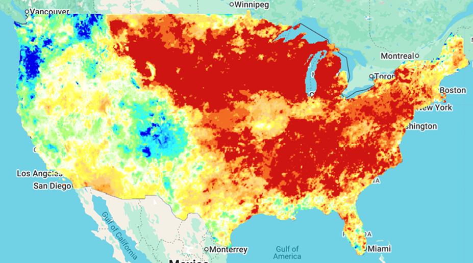

# WildRisk
scuffed congressional app challenge built with vanilla js, html, css, leaflet, califoria wildfire data, and lies.

## usage
go to vercel deployment link

## development
clone this repo. go to the root folder. run npm install. run code . . run npm run dev. do whatever you want

